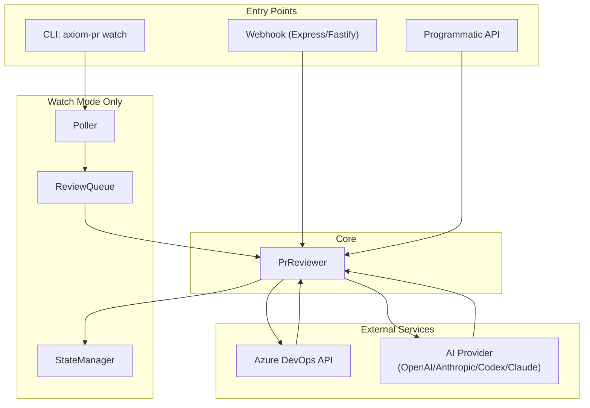

# Architecture Flow

## Mermaid Diagram



## High-Level Overview

```
┌─────────────────────────────────────────────────────────────────────────────────┐
│                                    AI Code Reviewer (axiom)                        │
└─────────────────────────────────────────────────────────────────────────────────┘

                              ┌──────────────────┐
                              │  Entry Points    │
                              └────────┬─────────┘
                                       │
              ┌────────────────────────┼────────────────────────┐
              │                        │                        │
              ▼                        ▼                        ▼
     ┌────────────────┐      ┌────────────────┐      ┌────────────────┐
     │ Webhook Mode   │      │  Watch Mode    │      │ Programmatic   │
     │ (Express/etc)  │      │  (CLI: watch)  │      │ (API call)     │
     └───────┬────────┘      └───────┬────────┘      └───────┬────────┘
             │                      │                       │
             │                      │  ┌─────────────┐     │
             │                      └──┤ Poller      │     │
             │                         │ (interval)  │     │
             │                         └──────┬──────┘     │
             │                                │            │
             │                         ┌──────▼──────┐     │
             │                         │ ReviewQueue │     │
             │                         └──────┬──────┘     │
             │                                │            │
             └────────────────────────────────┼────────────┘
                                              │
                                              ▼
                              ┌───────────────────────────────┐
                              │       PrReviewer              │
                              │  (core orchestration logic)    │
                              └───────────────┬───────────────┘
                                              │
              ┌───────────────────────────────┼───────────────────────────────┐
              │                               │                               │
              ▼                               ▼                               ▼
     ┌────────────────┐             ┌────────────────┐             ┌────────────────┐
     │ AzureDevOps    │             │  AI Provider   │             │ StateManager   │
     │ Client         │             │  (pluggable)   │             │ (watch mode)   │
     └───────┬────────┘             └───────┬────────┘             └────────────────┘
             │                              │
             │                              │
             ▼                              ▼
     ┌────────────────┐             ┌────────────────┐
     │ Azure DevOps   │             │ AI Providers   │
     │ REST API       │             │ OpenAI /       │
     │ (PRs, files,   │             │ Anthropic /    │
     │  comments)     │             │ Codex / Claude │
     └────────────────┘             └────────────────┘
```

## Review Flow (Step-by-Step)

```
1. TRIGGER
   ├─ Webhook: Azure DevOps sends POST when PR created/updated
   ├─ Watch:   Poller discovers new PRs on interval
   └─ Direct:  reviewPullRequest(project, repoId, prId) called

2. FETCH
   PrReviewer → AzureDevOpsClient
   ├─ getPrIterations()      → latest iteration
   ├─ getIterationChanges() → list of changed files
   └─ getFileContent()      → actual file diffs (batched)

3. FILTER
   ├─ Reviewable: remove deleted/skipped files (lock files, images, dist/, node_modules/)
   ├─ Cap:        maxFiles (default 30)
   └─ Truncate: maxDiffLength per file

4. AI REVIEW
   PrReviewer → AiProvider (Codex CLI | Claude Code | OpenAI | Anthropic)
   ├─ Chunk files if too large
   ├─ API-key providers use the tool-backed prompt path
   ├─ Codex/Claude use an embedded review packet prompt path
   ├─ CLI chunking uses fully rendered prompt size, so files per chunk vary
   ├─ Codex reasoning effort and Claude effort are configurable
   └─ Parse JSON response → { comments[] }

5. POST RESULTS
   PrReviewer → AzureDevOpsClient
   ├─ setPrStatus('pending')           → "AI review in progress"
   ├─ createCommentThread()            → inline comments per issue
   ├─ createGeneralComment()           → error notice on failure
   └─ setPrStatus('succeeded'|'failed') → based on critical issues
```

## Component Responsibilities

| Component             | Role                                                                                                   |
| --------------------- | ------------------------------------------------------------------------------------------------------ |
| **PrReviewer**        | Orchestrates the full review: fetch → filter → AI → post. Handles webhook verification, deduplication. |
| **AzureDevOpsClient** | All Azure DevOps API calls (PRs, iterations, file content, comments, status).                          |
| **AiProvider**        | Abstract interface; implementations for Codex CLI, Claude Code, OpenAI, and Anthropic.                |
| **Poller**            | (Watch mode) Periodically lists active PRs, detects new ones, enqueues for review.                     |
| **ReviewQueue**       | (Watch mode) Serializes review jobs, processes one at a time.                                          |
| **StateManager**      | (Watch mode) Persists reviewed PR iterations per provider to avoid re-reviewing.                     |
| **TuiStore / TUI**    | (Watch mode) Terminal UI showing repos, queue, logs, progress.                                         |

## External Dependencies

```
┌─────────────────┐     ┌─────────────────┐     ┌─────────────────┐
│ Azure DevOps    │     │ AI Providers    │     │ Your Server     │
│ • Service Hooks │     │ • Codex CLI     │     │ • Webhook route │
│ • REST API      │     │ • Claude Code   │     │ • Express/      │
│ • PAT auth      │     │ • OpenAI        │     │   Fastify/Nest  │
│                 │     │ • Anthropic     │     │                 │
└─────────────────┘     └─────────────────┘     └─────────────────┘
```

## Provider-CLI Notes

- Codex and Claude do not use the in-process tool-calling path used by OpenAI/Anthropic API-key mode.
- Instead, Axiom builds an embedded review packet containing project context, changed-line metadata, existing PR thread summaries, and file diffs.
- The TUI progress copy reflects three review-scope counts: total changed files, reviewable files after filtering, and the capped file count actually selected for review.
- Codex supports `reasoningEffort: low|medium|high|xhigh`; Claude supports `effort: low|medium|high|max`.
